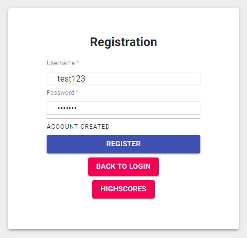

# Fortnite2D
A school project of a browser 2D shooter game. Back-end uses node.js, AJAX, REST, websockets, sqlite3, express, Javascript, and JQuery. Front-end was implemented using React, HTML, and CSS.

Images
-------

